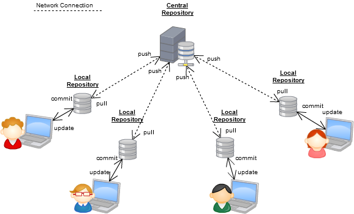

% Introduction to Git for Scientists
% Simon Cockell
% 6th June 2017


Why version control?
--------------------


<span style="font-size:12px">* Source: <http://phdcomics.com/comics/archive.php?comicid=1531></span>

Why version control?
--------------------
  * This sort of _ad hoc_ versioning doesn't scale
  * Services like [Dropbox][1] and [Google Drive][2] can improve matters
    * Risk deletion or corruption
    * What happens on one computer propagates to whole project
    * Still not great for projects >1 directory
  * Problems faced by software engineers for a long time
    * So -- version control

What is Git?
------------
<span style="color:red">Git is a distributed version control system.</span>

  * Git stores the history of all changes made to a project
  * You can use it to roll back these changes at any time
    * and to any point
  * It's also a tool for collaboration
  * Git can handle integrating changes from multiple people

What is Git?
------------
  * Git was written by Linus Torvalds
    * To manage the code for the Linux kernel
    * Thousands of collaborators
    * Huge codebase

Still unconvinced? What git can do for you
------------------------------------------
  * Keep snapshots of your project
    * Freeze a version at submission of publication
    * Subsequent version with revision
  * Keep track of important changes to code (and other files)
    * Allow even distant collaborators to keep up with developments
  * Keep projects organised and available after people leave

How to use Git -- the basics
----------------------------
Installing Git

  * MacOS - use [Homebrew][3]
    * `brew install git`
  * Linux - use your package manager
    * `apt install git`
  * Windows - <span style='text-decoration:line-through'>use Mac or Linux</span>
    * [download installer package][4]

All git commands are of the form `git verb` where `verb` is the thing you want git to do.

config
------

Set global git configurations. Because git is a collaborative platform, you need to identify yourself:

```bash
$ git config --global user.name "Donald Duck"
$ git config --global user.email "donald@disney.com"
```

Other useful configuration options:

```bash
# Set up git to use terminal colours
$ git config --global color.ui true
# Change the default text editor used for commit messages
$ git config --global core.editor "vim"
```

init
----
Initialise a new repository

```bash
$ mkdir mynewrepo
$ cd mynewrepo
$ git init
Initialized empty Git repository in /path/to/mynewrepo/.git/
```
Creates a hidden directory (`.git/`) which is what manages the repo under the hood

clone
-----

Take a copy of another repository - often used if you want to grab someone's code from (e.g.) Github

```bash
$ git clone git://github.com/broadgsa/gatk.git
Cloning into 'gatk'...
remote: Counting objects: 175297, done.
remote: Total 175297 (delta 0), reused 0 (delta 0), pack-reused 175297
Receiving objects: 100% (175297/175297), 247.52 MiB | 11.54 MiB/s, done.
Resolving deltas: 100% (97299/97299), done.
```

This gives you access to new updates as they're released -- you won't have permission to push changes to this repo.

add
---

We created a repository with `init`, but it's not tracking anything.

Use `add` to track files in your repo (the files will need to exist).

```bash
$ touch README
$ git add README
```

Now, git is tracking our new `README` file.

status
------

`status` tells you about git's status of the files in your repository

```bash
$ git status
On branch master

Initial commit

Changes to be committed:
  (use "git rm --cached <file>..." to unstage)

	new file:   README
```

status
------

If we create a new file, but don't `add` it, `status` tells us so

```bash
$ touch newfile
$ git status
On branch master

Initial commit

Changes to be committed:
  (use "git rm --cached <file>..." to unstage)

	new file:   README

Untracked files:
  (use "git add <file>..." to include in what will be committed)

	newfile
```

commit
------

Time to take a snapshot of our project

```bash
# first add the untracked file
$ git add newfile
# now take the snapshot
$ git commit -m "My first commit"
```

The `-m` option lets you add a commit message. If you don't do this at the command line,
git will open it's `core.editor` and make you write one.

Commit messages
---------------

This is an important way of documenting your project, and what's in the commit.
You should be able to find a relevant commit from the message.


<span style="font-size:12px">* Source: <http://xkcd.com/1296></span>

Final word on add, status and commit
------------------------------------

Tracking and staging are different concepts in git. A tracked file is not necessarily
staged for the next commit. Even tracked files need to be `add`ed (staged) before commit:

Final word on add, status and commit
------------------------------------

```bash
$ echo "Copyright (c) 2017, Donald Duck" > README
$ git status
On branch master
Changes not staged for commit:
  (use "git add <file>..." to update what will be committed)
  (use "git checkout -- <file>..." to discard changes in working directory)

	modified:   README

no changes added to commit (use "git add" and/or "git commit -a")
```

Final word on add, status and commit
------------------------------------
We have to `git add README` again to stage the change so it can be committed.
Thankfully, git provides us with a shortcut: `git commit -a` will automatically
stage all modified tracked files.


diff
----

`git diff` will show us the difference between the working tree and the index (what's currently staged for commit).

```bash
$ echo "This is the README file for a test project" >> README
$ git diff
diff --git a/README b/README
index c13c494..45724b3 100644
--- a/README
+++ b/README
@@ -1 +1,2 @@
 Copyright (c) 2017, Donald Duck
+This is the README file for a test project
```

log
---

As the name suggests, this verb shows you the commit history of the project:

```bash
$ git log
commit c745d67bfc071f9e8bad4c44dcc7b47be089ee4e
Author: Donald Duck <donald@disney.com>
Date:   Fri May 26 09:15:08 2017 +0100

    Second commit

commit 213caa7b311b8196fedc9dfe72ba4dc449d60b50
Author: Donald Duck <donald@disney.com>
Date:   Thu May 25 15:36:30 2017 +0100

    My first commit
```

mv and rm
---------

Once a file is tracked by git, the VCS becomes a bit of a control freak -- so if you want to move or delete a file, it's best to do it through git.

mv and rm
---------

```bash
$ mv README README.bak
$ git status
On branch master
Changes not staged for commit:
  (use "git add/rm <file>..." to update what will be committed)
  (use "git checkout -- <file>..." to discard changes in working directory)

	deleted:    README

Untracked files:
  (use "git add <file>..." to include in what will be committed)

	README.bak

no changes added to commit (use "git add" and/or "git commit -a")
```

mv and rm
---------

```bash
$ git mv README README.bak
$ git status
On branch master
Changes to be committed:
  (use "git reset HEAD <file>..." to unstage)

	renamed:    README -> README.bak

Changes not staged for commit:
  (use "git add <file>..." to update what will be committed)
  (use "git checkout -- <file>..." to discard changes in working directory)

	modified:   README.bak
```

ignore
------
There will often be files in a project directory that we don't want to track. This is especially true of large files (e.g. data), that git doesn't handle well.

Ignoring is controlled by the contents of a .gitignore file.

ignore
------

```bash
$ echo 'data' > .gitignore
$ curl -o data/grch38.fa ftp://anonymous@ftp.ensembl.org/pub/release-89/fasta/homo_sapiens/dna/Homo_sapiens.GRCh38.dna.toplevel.fa.gz
$ git status
On branch master
Changes not staged for commit:
  (use "git add <file>..." to update what will be committed)
  (use "git checkout -- <file>..." to discard changes in working directory)

	modified:   README

Untracked files:
  (use "git add <file>..." to include in what will be committed)

	.gitignore

no changes added to commit (use "git add" and/or "git commit -a")

```

reset
-----

Undo any mistaken changes. Can be used to rollback uncommitted changes, or revert to an old commit.

```bash
$ git commit -a -m "Committing .gitignore"
$ echo "A destructive change" > README
$ git commit -a -m "Oops"
$ git log
commit f361ea3c091ed804b43f1c88aa359d6625c13386
Author: Donald Duck <donald@disney.com>
Date:   Fri May 26 09:56:39 2017 +0100

    Oops

commit 5e764bea879d61acb10e89479faa89291df7ab94
Author: Donald ...
```

reset
-----
```bash
$ git reset --hard 5e764bea879d61acb10e89479faa89291df7ab94
HEAD is now at 5e764be Committing .gitignore
$ cat README
Copyright (c) 2017, Donald Duck
This is the README file for a test project
```

Git for collaboration
---------------------

So far, all operations have been with a *local repository*. Remote repositories can be used to enable git as a collaborative tool.

Git for collaboration
---------------------

Centralised version control - e.g. Subversion


Git for collaboration
---------------------

Distributed version control



Git for collaboration
---------------------

More complicated distributed version control


Github
------

Github will often perform the role of the 'central server' for git repositories.

  * Free, with premium options
  * Educational accounts
  * "Social" features for organising collaborations around code


Getting setup with Github
-------------------------

Some steps required to get going with Github:

  * Sign up for an account
  * When signed in, click the '+' in the top right
    * Select 'New Repository'
  * Follow the on screen steps to set up your repo

Getting setup with Github
-------------------------

Once your repo is up and running, you can grab a local copy:

```bash
$ git clone git://github.com/YOURUSERNAME/YOURNEWREPO.git
```

Getting setup with Github
-------------------------

You can also set an existing repository up with a new Github repo:

```bash
$ git remote add origin git@github.com:YOURUSERNAME/YOURNEWREPO.git
```

This uses the `remote` verb to add a named remote repository (in this case `origin` - which is the conventional default).

Authenticating with Github
--------------------------

Github needs to know who you are so you can send it updates to your projects.

  * Github uses SSH keys for authentication
  * Out of scope here, but see Github Help:

<https://help.github.com/articles/connecting-to-github-with-ssh/>

push
----

Send your commits to the remote repository.

```bash
$ git push origin master
```

This is of the form

`git push <remote-name> <branch>`

the defaults for `remote-name` and `branch` are `origin` and `master`.

Once you've `push`ed once, git will fall back on your last `remote-name` and `branch`, so `git push` will suffice.

pull
----

Download the latest updates from the remote repository.

Works very similarly to `push`:

```bash
$ git pull origin master
```

It's good to get into the habit of `pull`ing before starting to work on a shared repository.

merge
-----

If two committers have submitted separate commits, they will have to be merged.

  * Easy if no conflicting changes
  * Manual decisions to make if not

Merging Conflicts
-----------------

A four-step guide:

  1. Use `git status` to find the conflicting file(s)
  1. Open and edit those files manually to a version that fixes the conflicting
  1. Use `git add` to tell Git that you've resolved the conflict in a particular file
  1. Once all conflicts are resolved, use `git status` to check staging, and `commit`


Forking and Pull requests
-------------------------

These are features of Github that are designed for collaborative working.

Forking allows you to make a copy of someone else's repository, so you can work on your own updates.

You can ask that your changes get merged (or pulled) into the parent via a pull request.

This is the primary Github methodology that allows for large collaborative projects, while the lead developer can maintain close control over commits to master.

Github Desktop
--------------

App for Mac and Windows; makes managing Github repos easy, and removes dependency on command line.

<https://desktop.github.com>

Other tools available, which work with Git services other than Github (e.g BitBucket, Gitlab). For example, GitKraken:

<https://www.gitkraken.com/>

Github Desktop
--------------


Acknowledgements
----------------

The content here follows closely the Git chapter of

"Bioinformatics Data Skills"

by

Vince Buffalo

O'Reilly Media Inc, 2015. ISBN: 978-1-449-35737-4

There's plenty more...
----------------------

We've barely scratched the surface here, but hopefully enough to get you past this:


For slides: <https://github.com/sjcockell/git-tutorial>

<span style="font-size:12px">* Source: <https://xkcd.com/1597/></span>

  [1]: dropbox.com
  [2]: drive.google.com
  [3]: https://brew.sh
  [4]: https://git-scm.com/download/win
